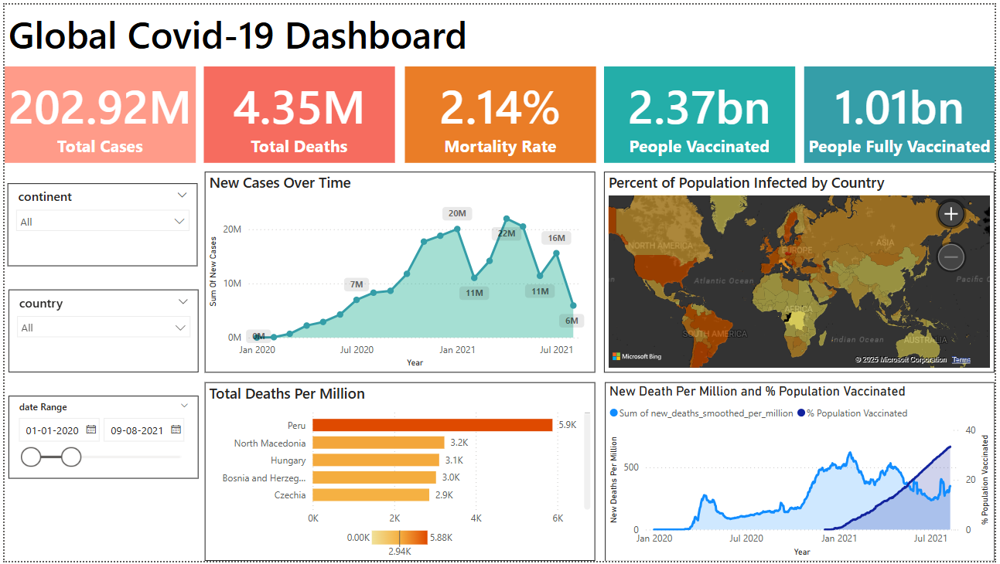

# COVID-19 Global Impact Analysis

The COVID-19 pandemic significantly impacted public health and global economies. To better understand its spread, severity, and the role of vaccination efforts, this project performs a full-stack data analysis using SQL, Python, and Power BI.

The goal is to extract actionable insights for stakeholders such as policymakers and public health professionals and helping them make data-driven decisions to save lives and improve future preparedness.

---

## 1. 📘 Background and Overview

The COVID-19 pandemic has affected millions globally, and understanding its trends is crucial for public health preparedness. This project integrates datasets on COVID-19 cases, deaths, and vaccinations to answer key questions:

- Which countries had the highest infection and mortality rates?
- How effective were vaccination campaigns?
- Which regions are most/least prepared for future outbreaks?

The project uses:

- Microsoft SQL Server for data preprocessing and KPI extraction  
- Python (Pandas, Seaborn, Matplotlib) for exploratory data analysis  
- Power BI for creating an interactive executive dashboard

---

## 2. 🧾 Data Structure Overview

Two primary datasets were merged on country and date:

### 🦠 CovidDeaths Table

| Column Name                    | Data Type        | Description                                               |
|-------------------------------|------------------|-----------------------------------------------------------|
| population                    | BIGINT           | Total population of the country                           |
| total_cases                   | BIGINT           | Cumulative number of confirmed COVID-19 cases             |
| new_cases                     | INT              | Newly reported cases on that date                         |
| new_cases_smoothed           | FLOAT            | 7-day smoothed value of new cases                         |
| total_deaths                  | BIGINT           | Cumulative number of confirmed COVID-19 deaths            |
| new_deaths                    | INT              | Newly reported deaths on that date                        |
| new_deaths_smoothed          | FLOAT            | 7-day smoothed value of new deaths                        |
| total_cases_per_million      | FLOAT            | Total cases per 1 million population                      |
| new_cases_per_million        | FLOAT            | New cases per 1 million population                        |
| new_cases_smoothed_per_million | FLOAT          | Smoothed new cases per 1 million                          |
| total_deaths_per_million     | FLOAT            | Total deaths per 1 million population                     |
| new_deaths_per_million       | FLOAT            | New deaths per 1 million population                       |
| new_deaths_smoothed_per_million | FLOAT         | Smoothed new deaths per 1 million                         |

### 💉 CovidVaccinations Table

| Column Name                         | Data Type     | Description                                             |
|------------------------------------|---------------|---------------------------------------------------------|
| iso_code                           | VARCHAR(10)   | ISO country code                                        |
| continent                          | VARCHAR(50)   | Continent name                                          |
| location                           | VARCHAR(100)  | Country or region name                                  |
| date                               | DATE          | Observation date                                        |
| people_vaccinated                  | BIGINT        | People who received at least one vaccine dose           |
| people_fully_vaccinated            | BIGINT        | People fully vaccinated                                 |
| people_vaccinated_per_hundred      | FLOAT         | People vaccinated per 100 people                        |
| people_fully_vaccinated_per_hundred| FLOAT         | Fully vaccinated per 100 people                         |

---

Key Measures Computed:
- Infection Rate = (Total Cases / Population) × 100  
- Death Rate = (Total Deaths / Population) × 100  
- Mortality Rate = (Total Deaths / Total Cases) × 100  
- Vaccination % = (Total People Vaccinated / Population) × 100  

---

## 3. 📊 Executive Summary

🌍 Global Highlights:

- 🌡 Highest infection rate: Brunei (76.99%), San Marino (74.24%)
- ⚰️ Highest mortality rate: Yemen (18.07%), Sudan (7.89%), Sirya (5.51%), Somalia (4.98%)
- 💉 Most vaccinated countries: Brunei (99%), Qatar (98.61%), UAE (97.55%)
- ⚠️ Least vaccinated countries: Burundi (0.28%), Yemen (2.75%), papua New Guinea (3.74%)
- 🟢 Lowest mortality rate countries: Vatican City, Tokelau, Falkland Islands (0 deaths)

🌐 Continent-wise Death Rates:

| Continent       | Death Rate (%) |
|-----------------|----------------|
| South America   | 0.3157         |
| North America   | 0.2824         |
| Europe          | 0.2818         |
| Oceania         | 0.0739         |
| Asia            | 0.0345         |
| Africa          | 0.0179         |

---

## 4. 🔍 Insights Deep Dive

📌 Top Insights:

- 🇷🇸 Brunei not only had the highest infection rate (76.99%) but also one of the highest cases per million (769K), suggesting widespread testing and small population effects.
- 🇵🇪 Peru recorded the highest deaths per million (6604), indicating a possible healthcare capacity challenge.
- 🇺🇸 The United States reported the highest total cases (103M) and total deaths (1.22M) globally.
- 🏥 Falkland Islands, Vatican, and Saint Helena reported zero COVID-19 deaths.
- 💉 Countries likeBrunei, Qtar, and UAE vaccinated more than 95% of their population.
- 🔻 Countries like Burundi and Yemen had alarmingly low vaccination rates (<5%).
🗜️ Explore interactive insights on vaccination, death trends, and more.

---

## 5. ✅ Recommendations

🎯 Based on the analysis, key actions for health policymakers and stakeholders include:

- Prioritize global vaccine equity: Countries like Burundi and Haiti need urgent vaccine access.
- Strengthen healthcare systems in high-death-rate regions (e.g., Peru, Bulgaria).
- Use dashboards like this for real-time monitoring and early warnings.
- Invest in digital tracking systems to ensure accurate case/death reporting.
- Encourage booster and outreach programs in countries with plateaued vaccination rates.

---

📂 Project Files:

- [`SQLQuery1.sql`](SQLQuery1.sq) – Power BI dashboard file  
- ['Covid-19 Dashboard.pbix'](Covid-19 Dashboard.pbix) – Power BI Dashboard File 

## 📬 Contact

**Chandra Kishor Mandal**  
*Aspiring Data Analyst | B.Tech in Industrial & Production Engineering (NIT Jalandhar)*  
📧 chandrakishorrv@gmail.com  
📍 India  
🔗 [LinkedIn – @chandrakishor06](https://www.linkedin.com/in/chandrakishor06)

